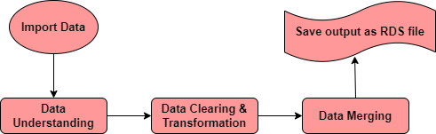
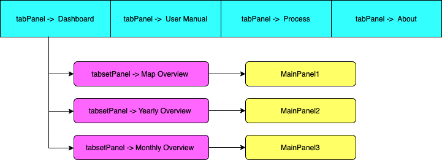

```{r global_options2, include=FALSE}
knitr::opts_chunk$set(warning=FALSE)
```

## 1. Brief Introduction
>This dashboard is built in R Shiny and used R Markdown to publish on this website. 
This is the documentation of web application that describes technical details of how the application was built, how was data cleaned and organised to load for the visualisation of this dashboard.

## 2. About the app

>The "Touri-Scope" app allows a user to look up a country of choice in the world and year, and see what the arrival of tourist is for that country over the chosen year/month. It also allow the user to view the event happen on the country on the chosen year.

>The goal for the app is to be a tool to quickly get a broad-level grasp of the arrival of tourist in a given country and year/month. User should be able to answer question like "how many arrival of tourist in Malaysia on year 2021?", "What are the significant event happen in Malaysia on year 2005?" and "Which country has the most significant arrival of tourist on year 2007?"

## 3. Inspiration for app

>Tourism is one of the hardest hit sector by COVID-19 in Malaysia. In fact, tourism is essential for the success of many economies around the world.

>Since April 2022, Malaysia has gradually reponed their broder to international arrivals. After the prolonged COVID-19 pandemic, the local tourism needs to prepare for the influx of tourists. The tourism-related business owners will need to devise their targeted sales plans based on types of tourists and stock up its inventory accordingly over the next 12 months. 

>An unsuccessful planning will lead to low sales, excess inventory, and subsequently put further pressure onto the capital position of the business. To devise the targeted sales plans, business owners compare the nationalities of tourists arriving in Malaysia in the past.

>Thus, the interest of our project is to study:

  - Which were the countries visited Malaysia the most before or after the pandemic?

  - How did COVID-19 affect the number of tourists visiting Malaysia?

  - Was there any seasonality on the arrivals of tourists from any specific country?

>Our motivation is to build a dashboard that allows people to analyse and better understand the trends of tourist arrivals to Malaysia before and after the pandemic.

## 4. Data Sources 

>The monthly tourist arrival data from year 2000 to year 2021 by country are provided by the Ministry of Tourism, Arts and Culture of Malaysia. 
The website retrieved: [Click Here](http://mytourismdata.tourism.gov.my)

>The World Events data were scraped from Wikipedia world event page. 
The website retrieved: [Click Here](https://en.wikipedia.org/wiki/Timeline_of_the_21st_century)

## 5. Technologies Used
>
```{r pressure1, echo=FALSE, out.width = '20%'}
knitr::include_graphics("tech1.png")
knitr::include_graphics("tech2.png")
knitr::include_graphics("tech3.png")
knitr::include_graphics("tech4.png")

knitr::include_graphics("tech6.png")

knitr::include_graphics("tech8.png")
knitr::include_graphics("tech9.png")

```

>The libraries we have imported from R consist of:
 
 - shinythemes
   - This is the package that used in R with Shiny applications to allow the user apply theme with shiny.
   
 - shinyWidgets
   - This is the package that used in R with Shiny applications to allow the user the apply a collection of custom input controls and user ineterface components for 'Shiny' applications.
   
 - rsconnect
   - This is a package for programmatic deployment interface for 'RPubs', 'shinyapps.io' and 'RStudio Connect'
 
 - sf
   - This is the package that support for simple features, a standardized way to encode spatial vector data
 
 - dplyr
   - This package is a fast and consistent tool for working with data frame that help you solve the most common data manipulation challenges. 

 - tidyr
   - This pacakage is used to simply the process of creating tidy data like extracting values out os string columns.
   
 - ggplot2
   - This is a plotting package that used to provides us a couple of helpful commands to create complex plots from data in a data frame.
   
 - plotly
   - This is a R package that used for creating interactive, publication quality web-based graphs via the open source JavaScript graphing library plotly.js
   
>We have visualize a couple of graphs for the result of analysis.

 - Gradient scale map
   - A gradient scale map is used to visualize the number of tourist arrivals from the selected countries to Malaysia on the selected year.
   
 - Table
   - A list of selected countries visiting Malaysia on the selected year will be shown in a form of table from the highest to the lowest.
   - A list of world events for the selected country and year(s) are shown so that the users are able to analyse if is the event happened on the selected countries is affecting the tourist arrivals to Malaysia on the specific period.
   
 - Area Chart
   - An interactive area chart is used to visualize the tourist arrivals from the selected country to Malaysia from year 2000 to year 2021.

 - Bar Graph
   - The graph used to indicate the yearly percentage change from year 2000 to year 2021.
   - A colour legend is shown to better indicate the percentage change.
   
 - Gauge Chart
   - A gauge chart is used to show the statistical descriptions (mean, standard deviation, maximum and minimum) for the tourist arrivals from selected countries to Malaysia from year 2000 to year 2021.
   
 - Line Chart
   - A line chart is used to display the monthly arrivals from the selected countries to Malaysia on the selected year(s) for comparison purpose.


## 6. Data Understanding & Pre-processing
>The standard workflow about data transformation looks like this:

```{r pressure2, echo=FALSE, out.width = '80%'}

```

> Tourism Arrival Data
>    The tourism arrival data was downloaded from My Tourism Data on the Arrivals by Country panel. The raw data was downloaded country by country then merge it into a table and convert into rds file:

 - tourism_yearly.rds
 - tourism_monthly.rds.

>The countries which has positive arrivals on travelling in Malaysia for less than 48 months are excluded for the analysis.
These countries include:

 - Sudan
 - Qatar
 - Uzbekistan
 - Kuwait
 - Nigeria
 - Austria
 - Brazil

> World Event Data
>    The World Event data were scraped from Wikipedia world event page from year 2000 to year 2021. The month of the event happened was extracted from the event description. The file was then write into a rds file: world_event.rds.


## 7. Shiny Applications
>The desgined Shiny applications have two important components, namely front-end **ui.R** and back-end **server.R**.
In **ui.R**, we created a structure of front-end, how we want our Shiny application to look like. Below is the basic diagram in demonstrating the **ui.R** for our application: 

```{r pressure3, echo=FALSE, out.width = '80%'}

```

## 8. Deployment
>The application is deployed on https://www.shinyapps.io/ web server. 

> Web application can be accessed directly from the URL: [Click Here](https://wqd7001-2021-2022-group7.shinyapps.io/Tourism_of_Malaysia_M14/)

## 9. Reference 

[1] Class materials provided by Dr. Salimah Mokhtar in the course "WQD7001 Principle of Data Science", University of Malaya, 2022

[2] [R for Data Science](https://r4ds.had.co.nz/), Garrett Grolemund, Hadley Wickham 

[3] [R Markdown: The Definitive Guide](https://bookdown.org/yihui/rmarkdown/), Yihui Xie, J. J. Allaire, Garrett Grolemund

[4] [Combining Shiny & R Markdown](https://beta.rstudioconnect.com/content/2671/Combining-Shiny-R-Markdown.html), R Studio

[5] [Malaysia tourism data](https://mytourismdata.tourism.gov.my), Government of Malaysia 

[6] [sf: Simple Features for R](https://cran.r-project.org/web/packages/sf/index.html), CRAN

[7] [shinyWidgets: Custom Inputs Widgets for Shiny](https://cran.r-project.org/web/packages/shinyWidgets/index.html), CRAN

[8] [shinythemes: Themes for Shiny](https://cran.r-project.org/web/packages/shinythemes/index.html), CRAN

[9] [dplyr: A Grammar of Data Manipulation](https://cran.r-project.org/web/packages/dplyr/index.html), CRAN

[10] [Package 'rsconnect'](https://cran.r-project.org/web/packages/rsconnect/rsconnect.pdf), CRAN

[11] [tidyr: Tidy Messy Data](https://cran.r-project.org/web/packages/tidyr/index.html), CRAN

[12] [Data visualization with ggplot2](https://datacarpentry.org/R-ecology-lesson/04-visualization-ggplot2.html), Data Carpentry contributors

[13] [Getting started with plotly in R](https://plotly.com/r/getting-started/), plotly

